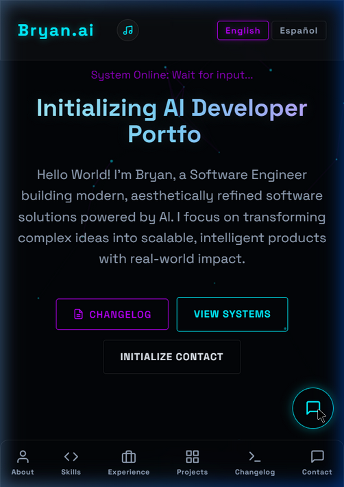

# 🚀 Bryan's AI-Powered Developer Portfolio v1.0

Welcome to the repository for my **AI-Powered Developer Portfolio**! This project is a modern, responsive, and deeply interactive web application showcasing accessible and bilingual Software Engineering, bridging robust web architecture with Artificial Intelligence.



## 🌌 Overview

This portfolio goes beyond a standard resume by natively integrating functional AI tools directly into the user experience. Built without heavy frontend frameworks, it uses clean, vanilla web technologies to deliver a lightning-fast, glassmorphism-themed interface with neon accents, custom animations, and a dynamic particle background.

## ✨ Key Features

- **🤖 Native AI Chat Assistant:** A fully integrated, conversational chatbot powered by **Gemini 2.0 Flash**. It features multi-turn context, Text-to-Speech (TTS), smart predefined callbacks, and understands both English and Spanish contexts seamlessly.
- **🌐 Fully Bilingual (EN/ES):** Real-time language toggling synced across the entire portfolio—including the UI, project descriptions, and the AI agent's responses.
- **📱 Responsive & Mobile-First:** Fluid layouts, a responsive carousel, and a mobile-specific bottom navigation bar to ensure a flawless experience on smartphones and tablets.
- **🎨 Glassmorphism & Cyberpunk Aesthetics:** A meticulously crafted dark theme (`#0a0a0f`) leveraging CSS custom properties, backdrop filters, and neon glows (`#00f0ff` & `#bd00ff`).
- **🛠️ Embedded AI Apps Gallery:** Live, interactable applications built directly into the portfolio:
    - **AI Text Summarizer:** Generates summaries and translates texts.
    - **AI Quiz Generator:** Dynamically creates quizzes on any given topic.
    - **AI Mood Journal:** Analyzes daily journal entries to log sentiments.
- **🎮 General Apps & Games:** Features an Interactive JavaScript Games suite and premium UI/UX applications like *Chronos Elegance*, *PlanFlow*, and *ArtVault*.
- **📧 Backend Integration (`main.py`):** Includes a Python FastAPI backend for secure SQLite database management and automated email notifications for the contact form.

## 💻 Tech Stack

- **Frontend:** HTML5, CSS3, Vanilla JavaScript, HTML5 Canvas (for particle engine)
- **Backend:** Python 3.11+, FastAPI, SQLite3, FastAPI-Mail
- **AI Integration:** Google Gemini REST API (`gemini-2.0-flash`)
- **Hosting / Deployment:** Built to be served statically or via an ASGI server for backend features.

## 🚀 Getting Started (Local Execution)

If you'd like to run this environment locally to test the API integrations and backend features:

### 1. Clone the repository
```bash
git clone https://github.com/Bryanspro/ai-portfolio.git
cd ai-portfolio
```

### 2. Configure Environment Variables
Copy the provided `.env.example` file to create your own `.env` file containing your Gemini API key and credentials:
```bash
cp .env.example .env
```
Open `.env` and fill in your details:
```properties
GEMINI_API_KEY="your_api_key_here"

# (Optional) Email Configuration for the Contact form
# MAIL_USERNAME="your_email@gmail.com"
# MAIL_PASSWORD="your_app_password"
# MAIL_FROM="your_email@gmail.com"
```

### 3. Install Backend Requirements
Make sure you have Python installed, then set up the required packages:
```bash
pip install -r requirements.txt
```

### 4. Run the Server
You have two ways to run the portfolio:

**Option A: Static Only (No Backend Features)**
```bash
python -m http.server 8000
```
Then navigate to `http://localhost:8000/index.html`

**Option B: Full Stack (FastAPI Backend enabled)**
```bash
uvicorn main:app --reload --port 8000
```
Then navigate to `http://localhost:8000/`

## 📜 Changelog

To see the detailed history of versions, features, and fixes (from `v0.1` to `v1.0`), please refer to the [CHANGELOG.md](./CHANGELOG.md) included in this repository.

## 📫 Connect with Me

- 💼 **LinkedIn:** [linkedin.com/in/bryanspro](https://linkedin.com/in/bryanspro)
- 🌐 Interested in seeing it live? Check out the deployed version (link coming soon).
- 💬 Reach out to me via the **Contact Form** natively inside the portfolio!

---
*System Initialized. Ready for deployment.*
